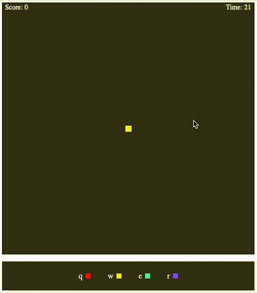

# Photon

A clicky game that requires mouse accuracy

## The game
- You are the [photon cannon](https://liquipedia.net/starcraft/Photon_Cannon) in the middle of the game map
- Enemies of various colors will spawn around the map
- You must click on the enemies to destroy them, but you can only destroy enemies that are the same as your current color
- Use `q`, `w`, `e`, `r` keys to change your color
- You have 60 seconds to destroy as many enemies as possible

## To play
- [Play it here! http://photon.surge.sh](http://photon.surge.sh)

OR

- Clone this repo
- `npm install`
- open `index.html` in a browser

## Todo
- [x] Add scoring
- [x] Have a way for the game to end
- [x] Increase difficulty the longer a game goes on
